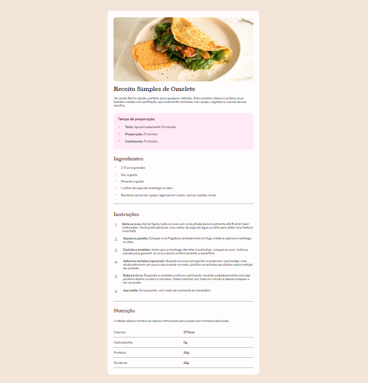
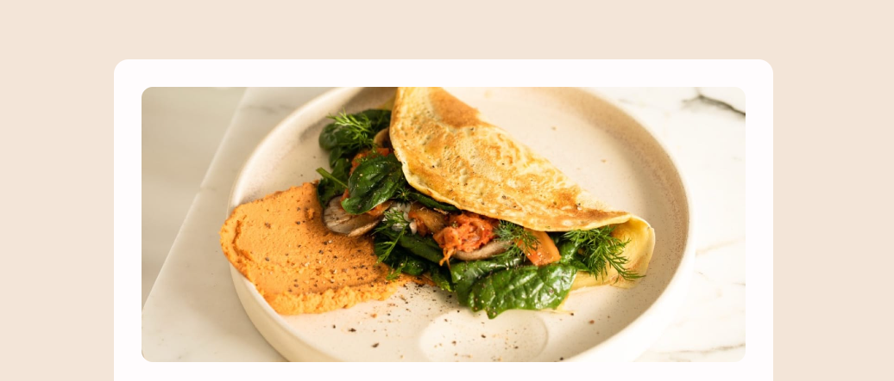
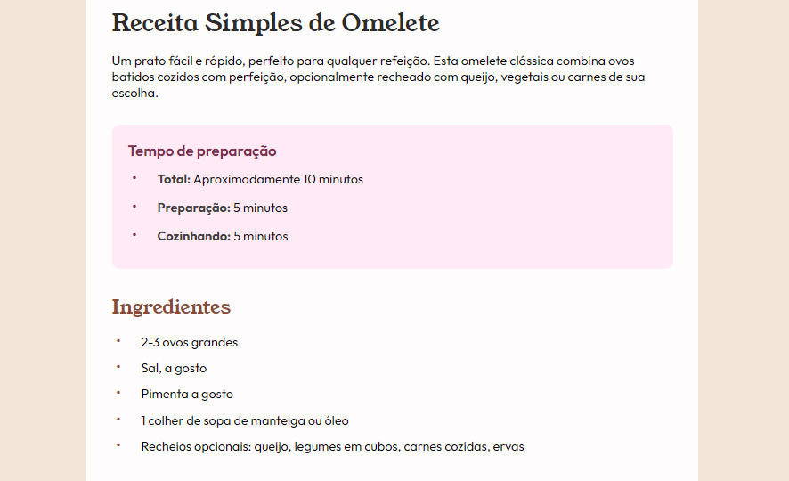
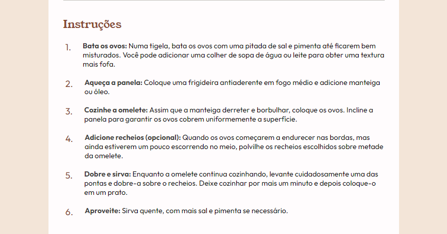
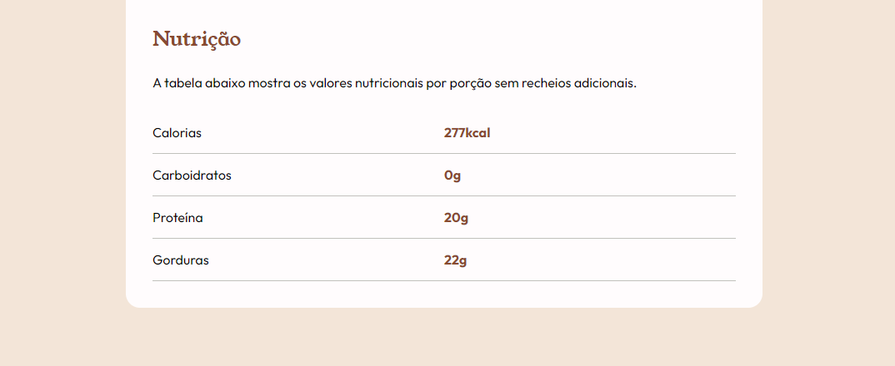

# Pagina principal da receita

## Bem-vindo! 👋
Obrigado por ver meu projeto!

## Descrição do projeto 😀
Esse projeto aborda sobre uma receita de um ovo, sendo a mesma a página principal, fiz ele com base nos dados transmitidos pelo FrontendMentor.

## Como utilizá-lo
Lendo as informações e seguindo passo a passa como diz a receita!

## Tem algum feedback? 😁
Adoro receber feedbacks! Estou sempre buscando melhorar meus projetos. Então, se você tiver algo que gostaria de mencionar, envie um e-mail para evex12324@gmail.com!

## Tecnologias utilizadas
Border, displays e eredeitariedade.

## Contribuidores
FrontendMentor

## Autor do projeto.
Pedro de Carvalho

**Compartilhe este repositório!** 🚀
